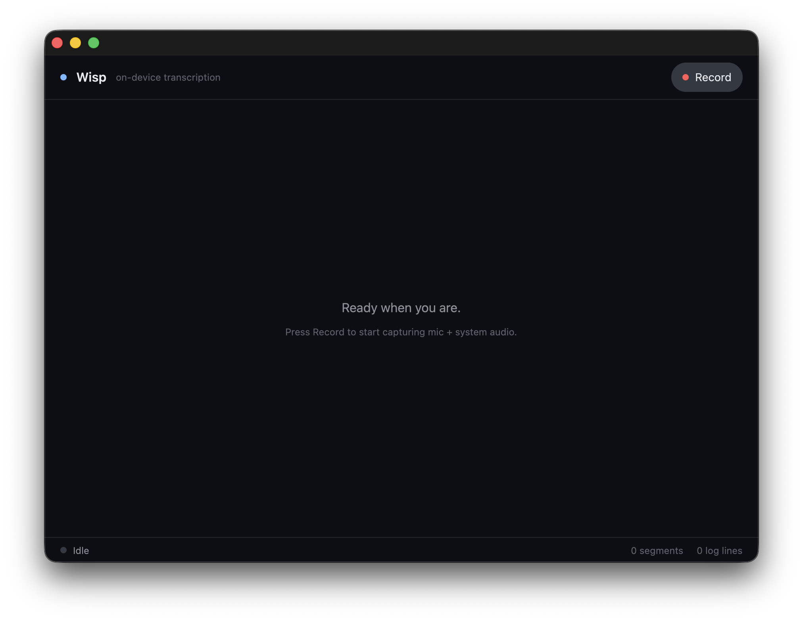

# Wisp

**A fully offline recording & transcription desktop app.**

Wisp captures your microphone and system audio (the other side of a call) at the same time and transcribes both on-device. Audio and text never leave your machine.

> macOS 26 (Tahoe) is the primary supported target. Windows support is in
> preview with `Windows.Media.SpeechRecognition` and local-model setup wiring.
> Linux support is coming soon.

---

## Features

- **Fully offline** — Audio and transcripts stay on your device. Wisp works with Wi-Fi turned off.
- **On-device transcription** — Uses [`SpeechAnalyzer`](https://developer.apple.com/documentation/speech), the new API in Apple's Speech framework on macOS. Windows preview builds can use `Windows.Media.SpeechRecognition` or prepare a local model from setup.
- **System audio + microphone capture** — Uses macOS 14.4+ [Core Audio Process Taps](https://developer.apple.com/documentation/coreaudio/capturing-system-audio-with-core-audio-taps) to tap meeting-app output without prompts, mixes it with your mic input, and merges both sides into a single transcript. Windows local-model work is structured around WASAPI mic + loopback capture.
- **Built in Rust with a GPU-rendered UI** — The UI is built on [GPUI](https://www.gpui.rs/), the framework that powers the [Zed](https://zed.dev/) editor. Native-feeling responsiveness and smooth scrolling.
- **Simple local storage** — Recordings are stored as WAV and metadata as SQLite under `~/Library/Application Support/dev.mokmok.wisp/`. Easy to export and analyze later.

## Screenshots



## Architecture

Wisp is a small Cargo workspace with cleanly separated concerns:

| Crate / target | Responsibility |
| --- | --- |
| `apps/wisp-desktop` | GPUI desktop shell. Renders recording state and the transcript view. |
| `crates/wisp-core` | Shared, platform-agnostic types (`Session`, `Segment`, IDs, `SourceLabel`). |
| `crates/wisp-audiokit` | Safe Rust wrapper around platform audio/transcription backends. |
| `crates/wisp-audiokit-sys` | Raw C ABI bindings to `WispAudioKit`. |
| `crates/wisp-storage` | Session/segment persistence on SQLite (bundled `rusqlite`). |
| `native/WispAudioKit` | Swift package handling Core Audio Process Tap capture and `SpeechAnalyzer` transcription. Linked into the Rust binary as a static library. |

Roughly, data flows like this:

```
Core Audio Process Tap ─┐
                        ├─► WispAudioKit ─► wisp-audiokit ─► wisp-desktop (GPUI)
Microphone input ───────┘        │                              ▲
                                 └─► SpeechAnalyzer ────────────┘
                                          │
                                          └─► wisp-storage (SQLite + WAV)
```

## Requirements

- **macOS 26 (Tahoe)** — Wisp relies on `SpeechAnalyzer`, Core Audio Process Taps, and the new Metal Toolchain, so macOS 26 is required for now.
- **Xcode 26** — for the Swift 6.0 / macOS 26 SDK.
- **Windows 10/11 preview** — uses `Windows.Media.SpeechRecognition` for the platform recognizer route and offers a setup route to download a local Whisper-family model under `%APPDATA%\dev.mokmok.wisp\models`.
- **Rust 1.96** — pinned in `rust-toolchain.toml`.
- Microphone and system-audio recording permissions. macOS will prompt on first launch.

## Build & run

A [Nix](https://nixos.org/) flake is included, so the dev environment is one command away:

```bash
# Enter the dev shell
nix develop

# Run a debug build
cargo run -p wisp-desktop
```

If you'd rather use Rust + Xcode directly:

```bash
cargo build -p wisp-desktop --release
```

### Formal verification

The session worker protocol and the whole-app navigation/session workflow have
executable TLA+ models plus symbolic one-step invariant proofs in Z3:

```bash
nix develop .#formal --command bash formal/check.sh
```

See [`formal/README.md`](formal/README.md) for the verified properties,
implementation mapping, assumptions, and extension workflow.

See `.github/workflows/release.yaml` for how the release `.app` bundle is produced — pushing a `v*` tag builds `Wisp.app` on a macOS 26 runner.

### Custom data directory

Set `WISP_DATA_DIR` to override where `sessions.db` and the `recordings/`
directory are stored. When unset, Wisp uses
`~/Library/Application Support/dev.mokmok.wisp`.

If a completed transcript cannot be committed to SQLite, Wisp writes an
atomic `transcript-recovery.json` beside that session's WAV files, blocks a
new recording, and retries reconciliation immediately or on the next launch.
Wisp exits before recording if the durable database cannot be opened; it never
treats an in-memory fallback as successful persistence.

### Local MCP bridge

Choose **Wisp → MCP Setup…** (or press <kbd>⌘,</kbd>) to open the guided setup window. From there you can enable the Local MCP Bridge and copy the bundled server path or ready-to-paste JSON for Claude and OpenCode. The bridge exposes the visible transcript through a local IPC endpoint. By default it binds to `http://127.0.0.1:8765/conversation`; set `WISP_IPC_ADDR=127.0.0.1:9001` to override the address while developing. Set `WISP_IPC_TOKEN` to require `Authorization: Bearer <token>` on IPC requests; copied client configs include the current address and, when set, the token.

MCP hosts should run the bundled `wisp-mcp` binary over stdio, for example `/Applications/Wisp.app/Contents/MacOS/wisp-mcp`. The bridge provides the `ask_current_conversation` tool, fetches the current Wisp transcript from the IPC endpoint, and returns context for the host LLM to answer questions such as `いまの話ってどういうこと?`.

`ask_current_conversation` accepts `loopback_seconds` (600 by default), `limit` (up to 500), and an opaque `cursor`. The time window is measured backward from the latest non-empty segment's end time. Without `limit`, it returns every non-empty segment that overlaps the window. With `limit`, the first page contains the last `limit` entries in Wisp display order. When the result's pagination data includes a non-null `next_cursor`, pass it back as `cursor` and provide `limit` to read the preceding page in display order. The cursor preserves the original session, view, and time window, and pins the original append boundary so later appended segments are excluded. This pagination limits the MCP response context; the local IPC endpoint remains backward-compatible and still returns the full visible snapshot.

## Roadmap

- [ ] **Windows support** — preview setup and `Windows.Media.SpeechRecognition` route are in place; WASAPI loopback + local-model transcription is the remaining hardening path.
- [ ] **Linux support** — exploring PipeWire monitor sources paired with a local Whisper-family model.
- [x] Copy transcript to clipboard and export as plain text (.txt).
- [ ] Export to Markdown / SRT / JSON.
- [ ] Speaker diarization within a single channel.

## Contributing

Issues and pull requests are welcome. Before sending a PR, please make sure `cargo fmt`, `cargo clippy --workspace --all-targets`, `cargo test --workspace`, and `nix develop .#formal --command bash formal/check.sh` pass under the same conditions as CI. For the Swift side, `make -C native/WispAudioKit` runs the equivalent checks.

## License

TBD (will be added before public release).
