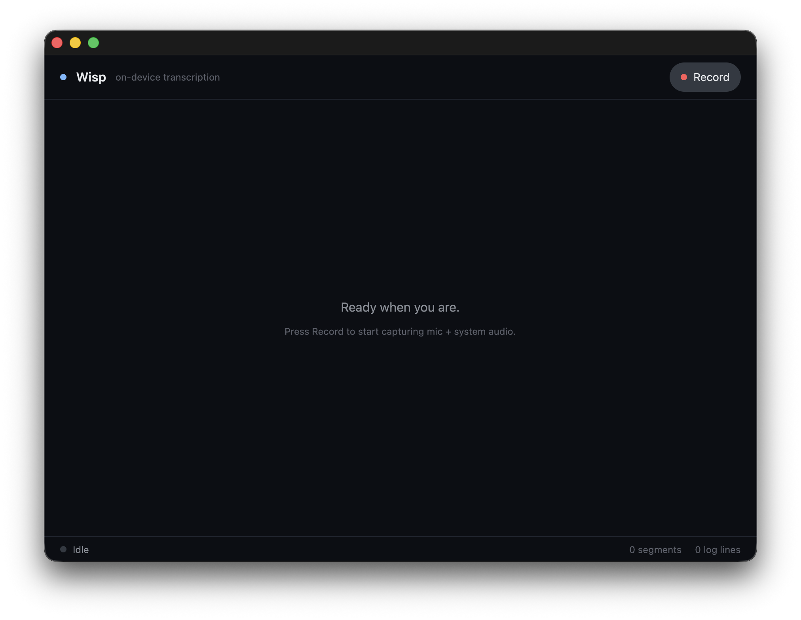

# Wisp

**A privacy-first recording & transcription desktop app.**

Wisp captures your microphone and system audio (the other side of a call) at the same time. macOS transcription runs on-device; Windows local transcription is under development.

> macOS 26 (Tahoe) is the primary supported target. Windows support is in
> preview: WASAPI recording stays local, while the optional
> `Windows.Media.SpeechRecognition` free-form dictation route uses Microsoft's
> online service. Local-model transcription wiring is in progress.
> Linux recording is in preview: PipeWire captures the default microphone and,
> when exposed by the session manager, the default sink monitor into separate
> Ogg/Opus files. Linux transcription is not implemented yet.

---

## Features

- **Offline-first** — macOS audio and transcripts stay on your device. Windows WASAPI recordings are local; fully local Windows transcription is the next integration step.
- **On-device transcription on macOS** — Uses [`SpeechAnalyzer`](https://developer.apple.com/documentation/speech), the new API in Apple's Speech framework. Windows' optional platform dictation backend is online.
- **System audio + microphone capture** — Uses macOS 14.2+ [Core Audio Process Taps](https://developer.apple.com/documentation/coreaudio/capturing-system-audio-with-core-audio-taps). Windows uses WASAPI shared-mode mic + system loopback capture. Linux uses PipeWire microphone + sink-monitor capture where the graph exposes a monitor. Windows and Linux store each source separately as Ogg/Opus.
- **Built in Rust with a GPU-rendered UI** — The UI is built on [GPUI](https://www.gpui.rs/), the framework that powers the [Zed](https://zed.dev/) editor. Native-feeling responsiveness and smooth scrolling.
- **Simple local storage** — Recordings are stored as Ogg/Opus and metadata as SQLite under `$WISP_DATA_DIR`, or `$HOME/Library/Application Support/dev.mokmok.wisp/` when the override is unset. Completed transcripts can be copied as plain text or exported as Markdown.

## Screenshots



## Architecture

Wisp is a small Cargo workspace with cleanly separated concerns:

| Crate / target | Responsibility |
| --- | --- |
| `apps/wisp-desktop` | GPUI desktop shell. Handles setup, recording controls, session history, transcript export, and the local IPC endpoint. |
| `apps/wisp-mcp` | Stdio MCP server that reads the visible transcript from the desktop app's local IPC endpoint. |
| `crates/wisp-core` | Shared, platform-agnostic types (`Session`, `Segment`, IDs, `SourceLabel`). |
| `crates/wisp-audiokit` | Platform audio/transcription backends and the backend-neutral session orchestrator. |
| `crates/wisp-audiokit-sys` | Raw C ABI bindings to the macOS `WispAudioKit` library. |
| `crates/wisp-lifecycle` | Session lifecycle state machine used by the runtime and formal verification. |
| `crates/wisp-storage` | Session/segment persistence on SQLite (bundled `rusqlite`). |
| `native/WispAudioKit` | macOS Swift package handling Core Audio Process Tap capture and `SpeechAnalyzer` transcription. Linked into the Rust binary as a static library. |

Roughly, data flows like this:

```
Core Audio Process Tap ─┐
                        ├─► WispAudioKit ─► wisp-audiokit ─► wisp-desktop (GPUI)
Microphone input ───────┘        │                              ▲
                                 ├─► SpeechAnalyzer ────────────┘
                                 └─► recordings (Ogg/Opus)       │
                                                                └─► wisp-storage (SQLite)
```

### Cross-platform audio boundary

The Rust boundary separates OS capture from transcription:

- `wisp-core` owns stable `TrackId`/`SourceKind`, device-native
  `AudioFormat`/`AudioFrame`, `CaptureEvent`, and partial/final
  `TranscriptEvent` contracts. The existing `SourceLabel::Mic` and
  `SourceLabel::System` map to fixed track IDs, so storage and UI behavior stay
  compatible while future application/process tracks remain possible.
- `wisp-audiokit` owns capability probes, `CaptureBackend` and
  `TranscriberBackend`, privacy-aware backend selection, and
  `SessionOrchestrator`. An offline-required policy never selects an online
  recognizer; when allowed, an unavailable recognizer degrades explicitly to
  record-only.
- Real-time capture producers use a bounded, non-blocking frame queue.
  Overflow is reported as a `CaptureEvent` with the affected track and dropped
  PCM frame count (not packet count). The separate control queue is also
  bounded and cannot carry sample payloads. Microphone and system audio remain
  separate tracks.
- macOS production capture and transcription run through concrete
  `MacosCaptureBackend` and `MacosTranscriberBackend` adapters managed by
  `SessionOrchestrator`. Swift sends typed mic/system PCM into the same bounded,
  nonblocking capture queue used by native backends while retaining Ogg/Opus
  recording. Capture PCM reaches Rust first; `MacosTranscriberBackend::push`
  then submits only frames accepted by `SessionOrchestrator` back to
  `SpeechAnalyzer`. `MacosCaptureBackend` also
  has an independent recording-only constructor so another transcriber can
  consume the exposed PCM without requesting speech permission. Transcript and
  compatibility callbacks retain their original ordering. The legacy
  `Session` API remains available but is no longer the macOS desktop path.

This boundary is intentionally a foundation, not a claim that every backend is
complete. Linux PipeWire recording is implemented, while Linux transcription,
connecting Windows WASAPI frames to actual local-model inference, and a
Nemotron transcriber adapter are follow-up work.

## Requirements

- **macOS 26 (Tahoe)** — Wisp relies on `SpeechAnalyzer`, Core Audio Process Taps, and the new Metal Toolchain, so macOS 26 is required for now.
- **Xcode 26** — for the Swift 6.0 / macOS 26 SDK.
- **Windows 10/11 preview** — records WASAPI mic + loopback audio locally. The
  `Windows.Media.SpeechRecognition` dictation route requires network access
  and MSIX package identity. Local-model download plumbing exists, but
  local-model inference is not connected yet.
- **Linux preview** — PipeWire 0.3 development files and `pkg-config` are
  required to build. A running PipeWire session manager must expose a default
  audio source; default-sink monitor capture is optional.
- **Rust 1.97.1** — pinned in `rust-toolchain.toml`.
- Microphone and system-audio recording permissions. macOS will prompt on first launch.

## Setup and usage

On macOS, first launch shows the microphone and speech-recognition permissions
needed for capture and on-device transcription. The desktop currently requests
the `ja-JP` transcription locale for each session.

Windows defaults to `Windows.Media.SpeechRecognition` online dictation for the
microphone while WASAPI records microphone and system audio locally. Linux
skips recognizer setup and runs in record-only mode.

To record and review a session:

1. Select **New Session**, then **Record**. Wisp keeps microphone and system
   audio as separate tracks.
2. Use **Mute mic** when needed, then **Stop** to drain and finalize the
   recording.
3. Open a saved session from the library to review its transcript.
4. Use **Copy** for `[MIC]` / `[SYS]` plain text, or **Export** for a Markdown
   file with YAML frontmatter.

On macOS, the application menu also provides these shortcuts:

| Action | Shortcut |
| --- | --- |
| Start / stop recording | <kbd>⌘R</kbd> |
| Copy transcript | <kbd>⌘⇧C</kbd> |
| Export transcript | <kbd>⌘⇧E</kbd> |
| Open MCP setup | <kbd>⌘,</kbd> |

## Build & run

A [Nix](https://nixos.org/) flake is included, so the dev environment is one command away:

```bash
# Enter the dev shell
nix develop

# Run a debug build
cargo run -p wisp-desktop
```

The local MCP bridge can also be built reproducibly with
[Crane](https://github.com/ipetkov/crane):

```bash
nix build .#wisp-mcp
./result/bin/wisp-mcp

# Run the checks available for the current Nix platform
nix flake check
```

On Linux, `nix flake check` runs Rust formatting plus Crane-backed Clippy and
tests for the workspace excluding `wisp-desktop`, and builds `wisp-mcp`. On
macOS, it runs Rust formatting and builds `wisp-mcp`; use the explicit Cargo
commands under [Contributing](#contributing) for workspace-wide lint and test
coverage.

Crane can cross-compile both Windows executables from a Linux Nix host:

```bash
nix build .#wisp-windows
```

If you'd rather use Rust + Xcode directly:

```bash
cargo build -p wisp-desktop --release
```

On Debian/Ubuntu Linux, install the PipeWire build dependency before building:

```bash
sudo apt install clang libclang-dev libpipewire-0.3-dev pkg-config
cargo build -p wisp-audiokit
```

`PipewireRecording::start(output_dir)` records to `mic.ogg` and `system.ogg`.
`system.ogg` remains a valid Ogg/Opus stream when the session manager does not
expose sink-monitor capture; it is padded with silence to keep both tracks on
a shared timeline. Normal `stop()` drains queued PCM and finalizes both files.
This API is record-only; it does not provide Linux
transcription.

Linux CI can exercise the real PipeWire path by starting an isolated PipeWire
daemon with a virtual default microphone (and optionally a default sink), then
running:

```bash
cargo test -p wisp-audiokit pipewire_virtual_node_integration -- --ignored
```

The ordinary test suite stays hardware-free and feeds synthetic frames through
the same alignment and Ogg/Opus finalization loop.

### Formal verification

The session worker protocol and navigation/session guards are checked against
the production Rust implementation with Kani and Shuttle:

```bash
bash formal/check.sh
```

See [`formal/README.md`](formal/README.md) for setup, verified properties, and
the extension workflow.

See `.github/workflows/release.yaml` for how the release `.app` bundle is produced — pushing a `v*` tag builds `Wisp.app` on a macOS 26 runner.

### Custom data directory

Set `WISP_DATA_DIR` to override where `sessions.db` and the `recordings/`
directory are stored. When unset, Wisp uses
`$HOME/Library/Application Support/dev.mokmok.wisp` on every current desktop
target. `HOME` must be available unless `WISP_DATA_DIR` is set. Settings are
stored as `settings.json`, and the optional local model is stored under
`models/` in the same directory.

If a completed transcript cannot be committed to SQLite, Wisp writes an
atomic `transcript-recovery.json` beside that session's Ogg files, blocks a
new recording, and retries reconciliation immediately or on the next launch.
Wisp exits before recording if the durable database cannot be opened; it never
treats an in-memory fallback as successful persistence.

### Local MCP bridge

Choose **Wisp → MCP Setup…** (or press <kbd>⌘,</kbd>) to open the guided setup window. From there you can enable the Local MCP Bridge and copy the bundled server path or ready-to-paste JSON for Claude and OpenCode. The enabled setting persists in `settings.json`. The bridge exposes the visible transcript through a local IPC endpoint. By default it binds to `http://127.0.0.1:8765/conversation`; set `WISP_IPC_ADDR=127.0.0.1:9001` to override the address and enable the bridge while developing, or set a truthy `WISP_IPC` value to enable it at the configured address. Set `WISP_IPC_TOKEN` to require `Authorization: Bearer <token>` on IPC requests; copied client configs include the current address and, when set, the token.

Keep `WISP_IPC_ADDR` bound to a loopback address unless you have secured the
connection. The endpoint exposes potentially sensitive transcript content over
plain HTTP, and the optional bearer token does not provide transport
encryption. For remote access, use a secured tunnel or TLS-enabled reverse
proxy with appropriate access controls instead of binding Wisp directly to a
non-loopback interface.

Loopback limits access to the host, not to the current OS user. Other local
processes or users on a shared host can reach an unauthenticated bridge, so set
a strong `WISP_IPC_TOKEN` whenever the bridge is enabled.

MCP hosts should run the bundled `wisp-mcp` binary over stdio, for example `/Applications/Wisp.app/Contents/MacOS/wisp-mcp`. `wisp-mcp` takes no command-line arguments; configure `WISP_IPC_ADDR` and `WISP_IPC_TOKEN` in the MCP client environment when needed. The bridge provides the `ask_current_conversation` tool, fetches the current Wisp transcript from the IPC endpoint, and returns context for the host LLM to answer questions such as `いまの話ってどういうこと?`.

`ask_current_conversation` requires `question`, a string containing the
question to answer from the current transcript. It also accepts
`loopback_seconds` (600 by default), `limit` (up to 500), and an opaque
`cursor`. The time window is measured backward from the latest non-empty segment's end time. Without `limit`, it returns every non-empty segment that overlaps the window. With `limit`, the first page contains the last `limit` entries in Wisp display order. When the result's pagination data includes a non-null `next_cursor`, pass it back as `cursor` and provide `limit` to read the preceding page in display order. The cursor preserves the original session, view, and time window, and pins the original append boundary so later appended segments are excluded. This pagination limits the MCP response context; the local IPC endpoint remains backward-compatible and still returns the full visible snapshot.

## Roadmap

- [ ] **Windows support** — WASAPI mic + loopback Ogg/Opus recording is in place; connecting the same PCM stream to local-model transcription is the remaining core path.
- [ ] **Linux transcription** — PipeWire mic + optional sink-monitor Ogg/Opus recording is in preview; pair its PCM stream with a local transcription backend.
- [ ] **Additional local models** — evaluate and implement Nemotron behind `TranscriberBackend`; no Nemotron runtime is bundled today.
- [x] Copy transcript to clipboard (plain text) and export as Markdown (`.md`) with a lightweight, CloudEvents-inspired YAML frontmatter envelope (`id`, `type`, `source`, `time`, `subject`, …).
- [ ] Export to SRT / JSON.
- [ ] Speaker diarization within a single channel.

## Contributing

Issues and pull requests are welcome. Before sending a PR, run the checks that
apply to your platform:

```bash
# Nix checks (the check set is platform-dependent; see Build & run)
nix flake check

# Complete Rust workspace checks on a supported host
cargo fmt --all -- --check
cargo clippy --workspace --all-targets -- -D warnings
cargo test --workspace --all-targets

# Formal lifecycle checks (requires cargo-kani)
bash formal/check.sh

# Swift formatting (available in the Nix CI shell)
nix develop .#ci --command swiftformat --lint \
  native/WispAudioKit/Sources native/WispAudioKit/Tests

# macOS 26 only
swift test --package-path native/WispAudioKit
```

## License

TBD (will be added before public release).
